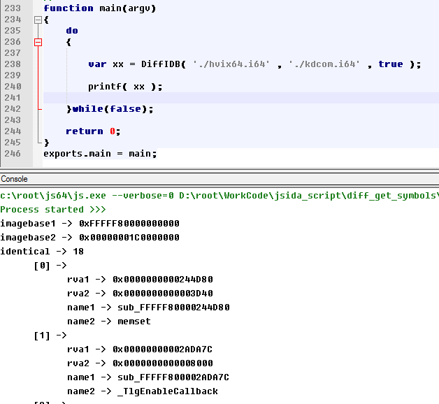
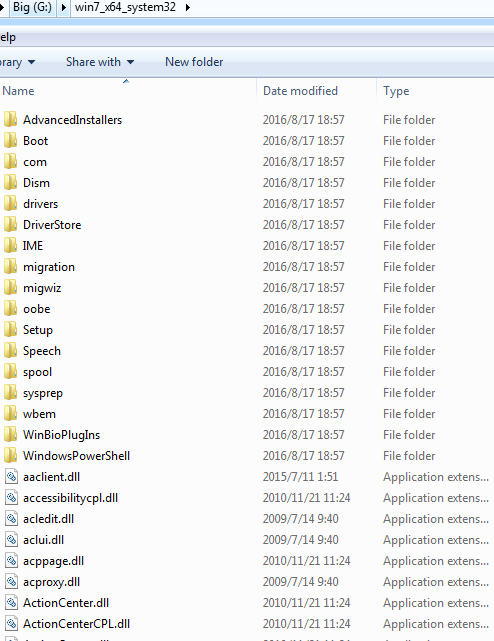

# fixed no symbol file via batch IDA diff

well , sometimes microsoft remove symbol  make it diffcult for us to reserve it .
there are two types,
  never released with a symbol like atmfd.dll or hvix64.exe
  provide symbol but remove at new version like tagWND of win32k.syswin32kfull.sys

if we can detect the function name  , it will help us to understand.

so i got a idea about use ida to diff a no-symbol-file with had-symbol-file , to detect the same code.
because many file are compiled with same lib or even same source code.

diff file manual  is not a good idea , so i modified PatchDiff2 to PatchDiff3 to enable auto-diff-analyze.
and with a some idc script
```c
#include idc.idc
static main()
{
	Batch(1);
	Wait();
	RunPlugin(PatchDiff3, 1989 );
	Exit(1);
}
```
wapper this opreation with my JSRT , it will like this.

for example , diff hvix64.exe with kdcom.dll



diff one file only provide little same function, so i wrote a script to batch diff no-symbol-file with had-symol-bin-folder

 first i need choose file that had symbols , via CopyHadSymbolBinFiles.sys
   

 batch run IDA analyze these files to idb
  

 batch diff no-symbol-file.idb with had-symbol-file folder to build a map file which about rva - name , with JSON style
```javascript
   {
	0x0000000000244D80 memset,
	0x00000000002ADA7C _TlgEnableCallback,
	0x00000000002709AC HviIsHypervisorVendorMicrosoft,
	0x00000000002908E8 ReadLsr,
	0x00000000002A2014 Bcm2835GetByte,
	0x0000000000279350 UsifGetByte,
	0x0000000000239DF0 Uart16550PutByte,
	0x00000000002A6734 KdpReceiveString,
	0x00000000002BA54C KdpSendString,
	0x00000000002A79CC KdDebuggerInitialize2,
	0x000000000026A228 __security_check_cookie,
	0x000000000022A050 KdPower,
	0x0000000000273AEC DoesPortExist,
	0x00000000002AF688 __security_init_cookie,
	0x000000000022ED60 MX6PutByte,
	0x0000000000298C14 HviIsAnyHypervisorPresent,
	0x0000000000244FAC UsifInitializePort,
	0x0000000000237990 __GSHandlerCheck
  }
```
 mixed these map file to a unique one 
 applay final rva-name map to no-symbol-file

## now , you got the right symbol name.

